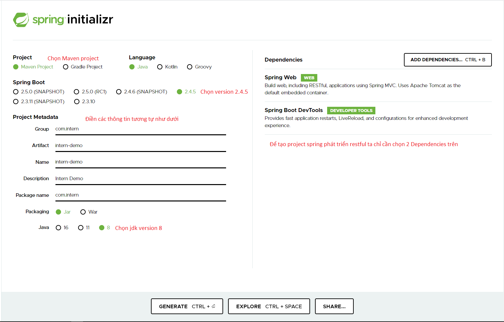
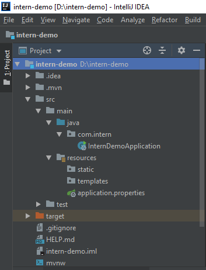
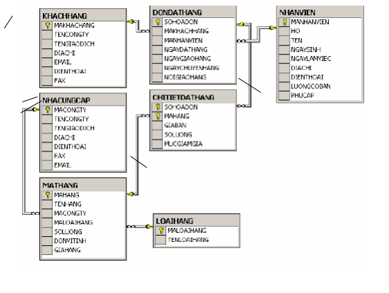
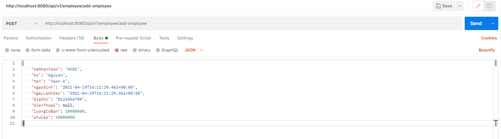

# Ex04: Spring boot - Restful cơ bản
Create by: TungBT - Bui Thanh Tung <<19/04/2021>>


# Mục tiêu bài học
- Hiểu biết về Restful API: Sinh ra để làm gì, sử dụng vào mục đích gì,...
- Hiểu biết HTTP methods chính và ý nghĩa của chúng
- Hiểu biết các HTTP status code cơ bản
- Tạo ứng dụng Spring boot để phát triển Restful API
- Biết cách tạo endpoint ứng dụng các Http methods
- Hiểu các annotation cơ bản của Spring:@RestController, @RequestMapping, @GetMapping, @RequestBody, @RequestParam,....


# Giới thiệu

## I. Restful
Restful API là một tiêu chuẩn dùng trong việc thiết kế API cho các ứng dụng web (thiết kế Web services) để tiện cho việc quản lý các resource. Nó chú trọng vào tài nguyên hệ thống (tệp văn bản, ảnh, âm thanh, video, hoặc dữ liệu động…), bao gồm các trạng thái tài nguyên được định dạng và được truyền tải qua HTTP.


## 1. HTTP Methods
REST hoạt động chủ yếu dựa vào giao thức HTTP. Các hoạt động cơ bản nêu trên sẽ sử dụng những phương thức HTTP riêng.
  - GET (SELECT): Trả về một Resource hoặc một danh sách Resource.
  - POST (CREATE): Tạo mới một Resource.
  - PUT (UPDATE): Cập nhật thông tin cho Resource.
  - DELETE (DELETE): Xoá một Resource.

## 2. HTTP Status Code
Khi chúng ta request một API nào đó thường thì sẽ có vài status code để nhận biết sau:
  - 200 OK – Trả về thành công cho những phương thức GET, PUT, PATCH hoặc DELETE.
  - 201 Created – Trả về khi một Resouce vừa được tạo thành công.
  - 204 No Content – Trả về khi Resource xoá thành công.
  - 304 Not Modified – Client có thể sử dụng dữ liệu cache.
  - 400 Bad Request – Request không hợp lệ
  - 401 Unauthorized – Request cần có auth.
  - 403 Forbidden – bị từ chối không cho phép.
  - 404 Not Found – Không tìm thấy resource từ URI
  - 405 Method Not Allowed – Phương thức không cho phép với user hiện tại.
  - 410 Gone – Resource không còn tồn tại, Version cũ đã không còn hỗ trợ.
  - 415 Unsupported Media Type – Không hỗ trợ kiểu Resource này.
  - 422 Unprocessable Entity – Dữ liệu không được xác thực

## II. Springboot - RestfulAPI
Trong java để thực hiện phát triển các RestfulAPI có rất nhiều các cách và các framework khác nhau và Springboot cũng là 1 trong số đó.
Để bắt đầu phát triển RestfulAPI bằng Springboot ta thực hiện các bước sau:

## 1. Khởi tạo project Springboot
Để khởi tạo project ta truy cập website chính thức của spring để giúp generate ra project.
https://start.spring.io/

Chúng ta setup các thông tin như sau:



Sau khi tạo generate xong ta được 1 project với cấu trúc như sau:



## 1. Tạo Api đầu tiên
* Lưu ý: Như trong Ex03 làm về Oracle chúng ta có các thông tin bảng sau, chúng ta sẽ làm tiếp tục các chức năng từ thông tin đó
* Chúng ta tạo package "rest" để chứa các class resouce api




## a. @GetMapping
@GetMapping sẽ tạo cho chúng ta 1 API có method GET và thường dùng cho việc truy vấn dữ liệu, lấy thông tin

Ví dụ lấy danh sách các nhân viên:

```ssh
package com.intern.rest;

@RestController
@RequestMapping("/api/v1/employees")
public class EmployeeRest {

    @GetMapping("/get-all")
    public ResponseEntity<List<NhanVienDTO>> getEmployees() {
        List<NhanVienDTO> dataResponse = new ArrayList<>();

        NhanVienDTO nv1 = new NhanVienDTO();
        nv1.setMaNhanVien("NV01");
        nv1.setHo("Nguyen");
        nv1.setTen("Vawn A");
        nv1.setNgaySinh(new Date());
        nv1.setNgayLamViec(new Date());
        nv1.setDiaChi("Ha Noi");
        nv1.setDiaChi("0123456789");
        nv1.setLuongCoBan(new BigDecimal("10000000"));
        nv1.setPhuCap(new BigDecimal("10000000"));

        dataResponse.add(nv1);

        return ResponseEntity.ok(dataResponse);
    }
}
```

 - @RestController: Giúp chúng ta khai báo ra 1 class để triển khai RestAPI
 - @RequestMapping("/api/v1/employees"): Tạo ra các restapi có endpoint bắt đầu bằng "/api/v1/employees"
 - @GetMapping("/get-all"): Khai báo 1 endpoint cụ thể
    + HTTP Methods: GET
    + Endpoint url: /get-all
 - Kết quả thực hiện:

```sh
URL: http://localhost:8080/api/v1/employee/employees
Response:
[
   {
      "maNhanVien":"NV01",
      "ho":"Nguyen",
      "ten":"Vawn A",
      "ngaySinh":"2021-04-19T16:11:29.462+00:00",
      "ngayLamViec":"2021-04-19T16:11:29.462+00:00",
      "diaChi":"0123456789",
      "dienThoai":null,
      "luongCoBan":10000000,
      "phuCap":10000000
   }
]
```

## b. @PostMapping, @RequestBody
 - @PostMapping sẽ tạo cho chúng ta 1 API với method là POST, thường dùng để cho việc tạo, thêm mới dữ liệu
 - Thường kết hợp với @PostMapping sẽ là @RequestBody dùng để nhận data của body request mà phía client gửi lên.

Ví dụ thêm mới 1 nhân viên:

```sh
    @PostMapping("/add-employee")
    public ResponseEntity<NhanVienDTO> addEmployee(@RequestBody NhanVienDTO nhanVienDTO) {
        System.out.println(nhanVienDTO);

        return ResponseEntity.ok(nhanVienDTO);
    }
```

 - Kết quả thực hiện <Chúng ta sử dụng postman để thực hiện POST request>
 

 - Log trên Inteliji: Đã nhận được đúng như chúng ta request gửi lên

```sh
NhanVienDTO{maNhanVien='NV01', ho='Nguyen', ten='Vawn A', ngaySinh=Mon Apr 19 23:11:29 ICT 2021, ngayLamViec=Mon Apr 19 23:11:29 ICT 2021, diaChi='0123456789', dienThoai='null', luongCoBan=10000000, phuCap=10000000}
```

## c. @PathVariable, @RequestParam
Trong khi truy vấn dữ liệu chúng ta cần truyền lên các tham số để làm điều kiện lọc dữ liệu. Trong Spring cung cấp 2 Anotation để phục vụ cho việc đó

 - @PathVariable: Cho phép truyền tham số lên trong url của API (cd:Lấy NV có mã là 10 ==> /employee/10)
 - @RequestParam: Cho phép truyền tham số trong url theo format "api-url?param1=10&param2=20"
 - Thực hiện

```ssh
    @GetMapping("/employee/{maNhanVien}")
    public ResponseEntity<String> getEmployees(@PathVariable String maNhanVien, @RequestParam String requestParam) {

        System.out.println("pathVariableMaNhanVien = " + maNhanVien);
        System.out.println("requestParam = " + requestParam);

        return ResponseEntity.ok("OK");
    }
```
 
- Kết quả

```ssh
URL: http://localhost:8080/api/v1/employee/employee/nhanvien01?requestParam=HaNoi

Logs:
pathVariableMaNhanVien = nhanvien01
requestParam = HaNoi
```

## Bài tập

Áp dụng kiến thức trên thực hiện viết các API (Chỉ cần đến phần rest chưa cần lưu db)thực hiện THÊM/SỬA/XÓA/LẤY TẤT CẢ/LẤY THEO MÃ với các bảng còn lại của bài Ex03
  - KHACHHANG
  - NHACUNGCAP
  - LOAIHANG
  - MATHANG
  - DONDATHANG
  - CHITIETDONDATHANG
 
Thanks,
TUNGBT.
