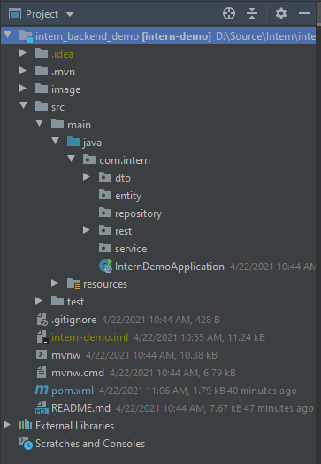
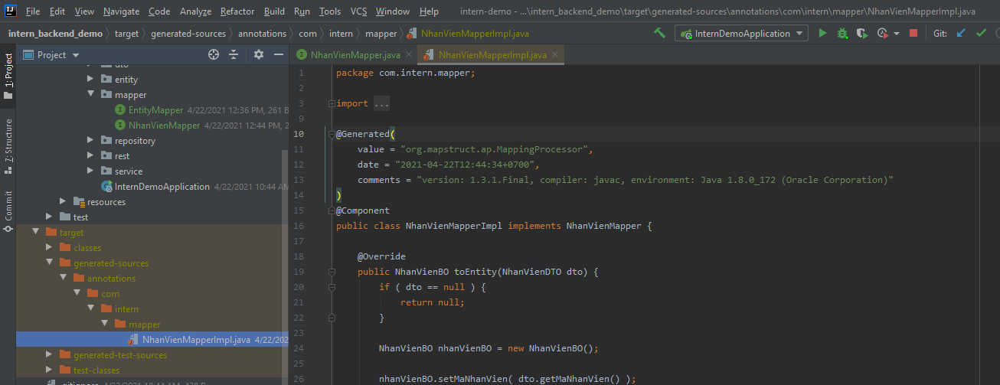
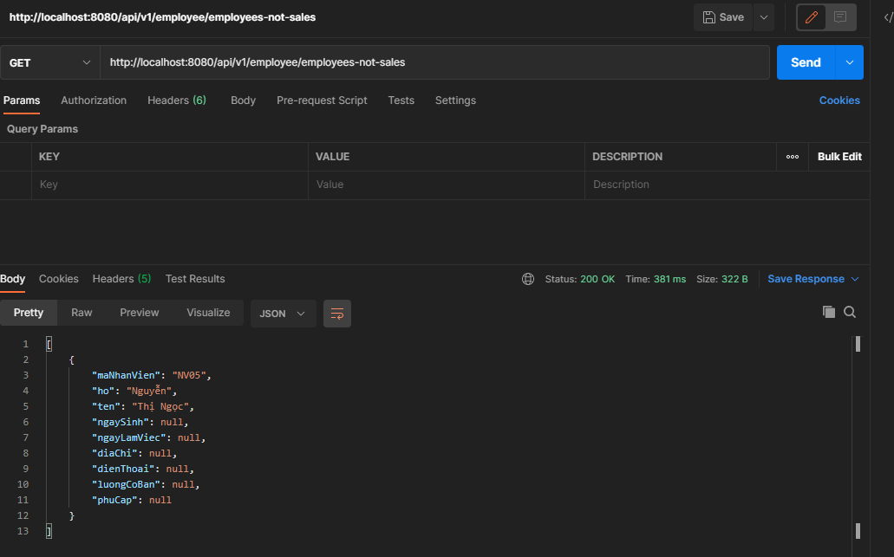

# Ex05: Spring boot - Data JPA
Create by: TungBT - Bui Thanh Tung <<22/04/2021>>


# Mục tiêu bài học
- Hiểu biết về Spring data jpa
- Biết cách áp dụng JPA vào các bài toán CRUD cơ bản
- Biết cách tạo Native SQL cho các câu Query phức tạp
- Hiểu về cơ chế commit, roolback transaction trong JPA


# Giới thiệu
Spring Boot JPA là một phần trong hệ sinh thái Spring Data, nó tạo ra một layer ở giữa tầng service và database, giúp chúng ta thao tác với database một cách dễ dàng hơn, tự động config và giảm thiểu code thừa thãi.

Spring Boot JPA đã wrapper Hibernate và tạo ra một interface mạnh mẽ. Nếu như bạn gặp khó khăn khi làm việc với Hibernate thì đừng lo, bạn hãy để Spring JPA làm hộ.

Như trong bài Ex03 về SQL chúng ta có các thiết kế bảng như sau, hôm nay chúng ta tiếp tục thao tác với các bảng đó.


# Thực hành

Như trong bài Ex04 - Spring boot Restful cơ bản chúng ta đã tạo được 1 project có cấu trúc package như sau:



## 1. Update pom.xml, thêm thư viện JPA và connector

```xml

<!--JPA Dependency-->
<dependency>
    <groupId>org.springframework.boot</groupId>
    <artifactId>spring-boot-starter-data-jpa</artifactId>
</dependency>
<!--My SQL Connector-->
<dependency>
    <groupId>mysql</groupId>
    <artifactId>mysql-connector-java</artifactId>
    <scope>runtime</scope>
</dependency>
<!--Mapper BO <-> DTO-->
<dependency>
    <groupId>org.mapstruct</groupId>
    <artifactId>mapstruct</artifactId>
    <version>1.3.1.Final</version>
</dependency>
<dependency>
    <groupId>org.mapstruct</groupId>
    <artifactId>mapstruct-processor</artifactId>
    <version>1.3.1.Final</version>
</dependency>

```

* Chú ý:
Phần [mysql-connector-java] sẽ tương ứng với database mình dùng, ở đây mình dùng MySQL

## 2. Cấu hình đến database

Chỉnh sửa cấu hình sang đúng thông tin DB về của mọi người

```properties

spring.datasource.url=jdbc:mysql://172.1.2.91:3306/day03_itsol?useSSL=false
spring.datasource.username=tungbt
spring.datasource.password=tungbt
spring.jpa.properties.hibernate.dialect=org.hibernate.dialect.MySQL5InnoDBDialect
spring.jpa.hibernate.ddl-auto=none
logging.level.org.hibernate=INFO

#Cấu hình show log câu query
spring.jpa.show-sql=true
spring.jpa.properties.hibernate.format_sql=true

```

## 3. Khai báo Entity

Entity sẽ là thành phần mapping trực tiếp với cơ sở dữ liệu
Ví dụ tạo class NhanVienBO để mapping với bảng NHANVIEN

 - Chú ý: Trong phần entity BO này chúng ta sẽ không dùng các annotation @OneToMany, @ManyToOne,... để tránh sự phức tạp trong việc sử lý dữ liệu

```java

package com.intern.entity;

import javax.persistence.Column;
import javax.persistence.Entity;
import javax.persistence.Id;
import javax.persistence.Table;
import java.math.BigDecimal;
import java.util.Date;

@Entity
@Table(name = "nhanvien")
public class NhanVienBO {
    @Id
    @Column(name = "MANHANVIEN")
    private String maNhanVien;
    @Column(name = "HO")
    private String ho;
    @Column(name = "TEN")
    private String ten;
    @Column(name = "NGAYSINH")
    private Date ngaySinh;
    @Column(name = "NGAYLAMVIEC")
    private Date ngayLamViec;
    @Column(name = "DIACHI")
    private String diaChi;
    @Column(name = "DIENTHOAI")
    private String dienThoai;
    @Column(name = "LUONGCOBAN")
    private BigDecimal luongCoBan;
    @Column(name = "PHUCAP")
    private BigDecimal phuCap;

    public NhanVienBO() {
    }

    public String getMaNhanVien() {
        return maNhanVien;
    }

    public void setMaNhanVien(String maNhanVien) {
        this.maNhanVien = maNhanVien;
    }

    public String getHo() {
        return ho;
    }

    public void setHo(String ho) {
        this.ho = ho;
    }

    public String getTen() {
        return ten;
    }

    public void setTen(String ten) {
        this.ten = ten;
    }

    public Date getNgaySinh() {
        return ngaySinh;
    }

    public void setNgaySinh(Date ngaySinh) {
        this.ngaySinh = ngaySinh;
    }

    public Date getNgayLamViec() {
        return ngayLamViec;
    }

    public void setNgayLamViec(Date ngayLamViec) {
        this.ngayLamViec = ngayLamViec;
    }

    public String getDiaChi() {
        return diaChi;
    }

    public void setDiaChi(String diaChi) {
        this.diaChi = diaChi;
    }

    public String getDienThoai() {
        return dienThoai;
    }

    public void setDienThoai(String dienThoai) {
        this.dienThoai = dienThoai;
    }

    public BigDecimal getLuongCoBan() {
        return luongCoBan;
    }

    public void setLuongCoBan(BigDecimal luongCoBan) {
        this.luongCoBan = luongCoBan;
    }

    public BigDecimal getPhuCap() {
        return phuCap;
    }

    public void setPhuCap(BigDecimal phuCap) {
        this.phuCap = phuCap;
    }
}


```

## 4. Tạo mapper dùng để convert dữ liệu giữa BO <-> DTO

 - Đầu tiên ta tạo 1 interface EntityMapper định nghĩa các methods convert
 
```java

package com.intern.mapper;

import java.util.List;

public interface EntityMapper<D, E> {
    public E toEntity(D dto);

    public D toDto(E entity);

    public List<E> toEntity(List<D> dtoList);

    public List <D> toDto(List<E> entityList);
}

```

 - Sau đó ta tạo thêm 1 interface NhanVienMapper dùng để mapper giữa NhanVienBO <--> NhanVienDTO
 
```java

package com.intern.mapper;

import com.intern.dto.NhanVienDTO;
import com.intern.entity.NhanVienBO;
import org.mapstruct.Mapper;

@Mapper(componentModel = "spring")
public interface NhanVienMapper extends EntityMapper<NhanVienDTO, NhanVienBO>{

}

```

Cách làm việc của Mapper như sau:

 - Khi chúng ta khai báo interface mapper (NhanVienMapper.java) thì trong quá trình compile (build project) thư viện sẽ tự động generate cho chúng ta class implement các phương thức
mà chúng ta đã khai báo và lưu trong target
 - Lưu ý: Mapper sẽ mapping các trường có cùng tên với nhau



Thanks,
TUNGBT.


## 5. Tạo JPA Repository
Với JpaRepository đã hỗ trợ cho chúng ta method CRUD cơ bản sau:

 - long count() – Trả về số entity 
 - void delete(T entity) – Xóa một entity
 - void deleteAll() – Xóa tất cả các entity 
 - void deleteAll(Iterable<? extends T> entities) – Xóa tập hợp các entity
 - void deleteById(ID id) – Xóa entity theo ID
 - boolean existsById(ID id) – Returns whether an entity with the given id exists. Trả về có hay không một entity với ID 
 - Iterable findAll() – Trả về tất cả instances của type.
 - Iterable findAllById(Iterable ids) -Trả về tất cả instance của type với ID.
 - Optional findById(ID id) – Tìm entity theo ID.
 - save(S entity) -Save một entity đã cho.
 - Iterable saveAll(Iterable entities) -Save tập hợp Entity.

Tiếp tục ví dụ, chúng ta sẽ tạo ra NhanVienRepository

```java

package com.intern.repository;

import com.intern.entity.NhanVienBO;
import org.springframework.data.jpa.repository.JpaRepository;
import org.springframework.stereotype.Repository;

@Repository
public interface NhanVienRepository extends JpaRepository<NhanVienBO, String> {
}

```

 - Lưu ý: <NhanVienBO, String>: sẽ có ý nghĩa lần lượt là
    * NhanVienBO: Class BO entity
    * String: Kiểu dữ liệu của trường đã khai báo annotation @Id
    
## 6. Tạo Service

Chúng ta sẽ tạo thêm 1 tầng service dùng để thao tác với Repository, luồng thực hiện của chúng ta bây giờ sẽ như sau:

Rest -> Service -> Repository

```java

package com.intern.service;

import com.intern.dto.NhanVienDTO;
import com.intern.entity.NhanVienBO;
import com.intern.mapper.NhanVienMapper;
import com.intern.repository.NhanVienRepository;
import org.springframework.beans.factory.annotation.Autowired;
import org.springframework.stereotype.Service;

import java.util.List;

@Service
public class NhanVienService {
    @Autowired
    private NhanVienRepository nhanVienRepository;
    @Autowired
    private NhanVienMapper nhanVienMapper;

    public List<NhanVienDTO> getEmployees() {
        List<NhanVienBO> bos = nhanVienRepository.findAll();
        return nhanVienMapper.toDto(bos);
    }
}

```

 - Trong service chúng ta cần Autowired(Tiêm sự phụ thuộc) 2 class NhanVienRepository và NhanVienMapper;
 - Trong method getEmployees()
    * Đầu tiên ta dùng repository.findAll() để query tất cả dữ liệu trong bảng NHANVIEN trả về List<BO>
    * Tiếp theo chúng ta dùng mapper để convert từ BO -> DTO và trả về cho rest
    
## 7. Chỉnh sửa Rest
Trong bài trước phần rest chúng ta đang dummy dữ liệu, bây giờ chúng ta sẽ chuyển sang lấy dữ liệu từ service

 - @Autowired NhanVienService và gọi getEmployees và trả về.

```java
package com.intern.rest;

import com.intern.dto.NhanVienDTO;
import com.intern.service.NhanVienService;
import org.springframework.beans.factory.annotation.Autowired;
import org.springframework.http.ResponseEntity;
import org.springframework.web.bind.annotation.GetMapping;
import org.springframework.web.bind.annotation.RequestMapping;
import org.springframework.web.bind.annotation.RestController;

import java.util.List;

@RestController
@RequestMapping("/api/v1/employee")
public class EmployeeRest {
    @Autowired
    private NhanVienService nhanVienService;

    @GetMapping("/employees")
    public ResponseEntity<List<NhanVienDTO>> getEmployees() {
        List<NhanVienDTO> dataResponse = nhanVienService.getEmployees();
        return ResponseEntity.ok(dataResponse);
    }
}

```

# Native SQL

Trong thực tế chúng ta cần query các câu SQL phức tạp (join nhiều bảng, nhiều điều kiên động khác nhau) và JPA không thể hỗ trợ được hết các trường hợp đó.
Chính vì vậy chúng ta cần dùng native SQL để thực hiện.

 - Chúng ta tạo thêm packge "dao" ngang hàng với repository

 - Trong bài Ex03 về SQL có câu số 4, bây giờ mình sẽ ví dụ trên câu này luôn
 
```sql

-----4. Những nhân viên nào của công ty chưa từng lập bất kỳ một hoá đơn đặt hàng nào?
SELECT
	NV.MANHANVIEN,
    NV.HO,
    NV.TEN 
FROM
	NHANVIEN NV 
WHERE NOT EXISTS ( SELECT DDH.MANHANVIEN FROM DONDATHANG DDH WHERE NV.MANHANVIEN = DDH.MANHANVIEN );

-- NOT EXISTS hoặc NOT IN: Tùy thuộc vào version MYSQL của bạn.

```

## 1. Tạo class NhanVienDAO để thực hiện NativeSQL

Đầu tiên chúng ta tạo NhanVienDAO

```java

package com.intern.dao;

import com.intern.dto.NhanVienDTO;
import org.springframework.stereotype.Repository;

import javax.persistence.EntityManager;
import javax.persistence.PersistenceContext;
import javax.persistence.Query;
import java.util.List;

@Repository
public class NhanVienDAO {
    @PersistenceContext
    private EntityManager entityManager;

    public List<NhanVienDTO> getEmployeeNotSales() {
        StringBuilder sql = new StringBuilder();
        sql.append(" SELECT ");
        sql.append("    NV.MANHANVIEN, ");
        sql.append("    NV.HO, ");
        sql.append("    NV.TEN ");
        sql.append(" FROM NHANVIEN NV ");
        sql.append(" WHERE NOT EXISTS ( SELECT DDH.MANHANVIEN FROM DONDATHANG DDH WHERE NV.MANHANVIEN = DDH.MANHANVIEN ) ");

        Query query = entityManager.createNativeQuery(sql.toString(), "emp_not_sales_mapping");
        return query.getResultList();
    }
}

```

 - Chúng ta dùng EntityManager để tạo Native SQL
 
```java

@PersistenceContext
private EntityManager entityManager;

```

 - Build SQL
 
```java

StringBuilder sql = new StringBuilder();
sql.append(" SELECT ");
sql.append("    NV.MANHANVIEN, ");
sql.append("    NV.HO, ");
sql.append("    NV.TEN ");
sql.append(" FROM NHANVIEN NV ");
sql.append(" WHERE NOT EXISTS ( SELECT DDH.MANHANVIEN FROM DONDATHANG DDH WHERE NV.MANHANVIEN = DDH.MANHANVIEN ) ")
```

 - Tạo Query
 
```java
Query query = entityManager.createNativeQuery(sql.toString(), "emp_not_sales_mapping");
```

* Chú ý: "emp_not_sales_mapping": là tên mapping để map từ Query Result về DTO, "emp_not_sales_mapping" sẽ được khai báo ở trong Entity BO

## 2. Trong NhanVienBO chúng ta sẽ tạo emp_not_sales_mapping

```java

package com.intern.entity;

import com.intern.dto.NhanVienDTO;

import javax.persistence.*;
import java.math.BigDecimal;
import java.time.ZonedDateTime;
import java.util.Date;

@Entity
@Table(name = "nhanvien")
@SqlResultSetMapping(
        name = "emp_not_sales_mapping",
        classes = {
                @ConstructorResult(
                        targetClass = NhanVienDTO.class,
                        columns = {
                                @ColumnResult(name = "MANHANVIEN", type = String.class),
                                @ColumnResult(name = "HO", type = String.class),
                                @ColumnResult(name = "TEN", type = String.class),
                        }
                )
        }
)
public class NhanVienBO {
    @Id
    @Column(name = "MANHANVIEN")
    private String maNhanVien;
    @Column(name = "HO")
    private String ho;
    @Column(name = "TEN")
    private String ten;
    @Column(name = "NGAYSINH")
    private Date ngaySinh;
    @Column(name = "NGAYLAMVIEC")
    private Date ngayLamViec;
    @Column(name = "DIACHI")
    private String diaChi;
    @Column(name = "DIENTHOAI")
    private String dienThoai;
    @Column(name = "LUONGCOBAN")
    private BigDecimal luongCoBan;
    @Column(name = "PHUCAP")
    private BigDecimal phuCap;

```

Chúng ta tạo SqlResultSetMapping

 - name: emp_not_sales_mapping --> dùng trong khi tạo Query bên DAO
 - targetClass = NhanVienDTO.class: NhanVienDTO.class Chính là class mà muốn mapping từ QueryResult sang DTO
 - columns: Khai báo tên các trường query, theo đúng thứ tự, tên, kiểu dữ liệu

## 3. Khai báo Constructor trong NhanVienDTO

Vì là @ConstructorResult nên chúng ta cần tạo 1 Constructor theo đúng THỨ TỰ CÁC TRƯỜNG

```java
public NhanVienDTO(String maNhanVien, String ho, String ten) {
        this.maNhanVien = maNhanVien;
        this.ho = ho;
        this.ten = ten;
}

```

## 4. Thêm bên service và rest để tạo 1 restful api cho methods trong DAO vừa rồi

 - Service

```java
@Autowired
private NhanVienDAO nhanVienDAO;

public List<NhanVienDTO> getEmpNotSales() {
    return nhanVienDAO.getEmployeeNotSales();
}
```

 - Rest

```java

@GetMapping("/employees-not-sales")
public ResponseEntity<List<NhanVienDTO>> getEmpNotSales() {
    List<NhanVienDTO> dataResponse = nhanVienService.getEmpNotSales();
    return ResponseEntity.ok(dataResponse);
}
```

 - Kết quả:




# Bài tập

Chúng ta sẽ áp dụng các kiến thức trên vào việc tạo các API THÊM/SỬA/XÓA/TRUY VẤN/NATIVE SQL với các bảng còn lại trong bài EX03.

  - KHACHHANG
  - NHACUNGCAP
  - LOAIHANG
  - MATHANG
  - DONDATHANG
  - CHITIETDONDATHANG
  
# Tiếp theo
Bài tiếp theo chúng ta sẽ học về Spring boot security, JWT
